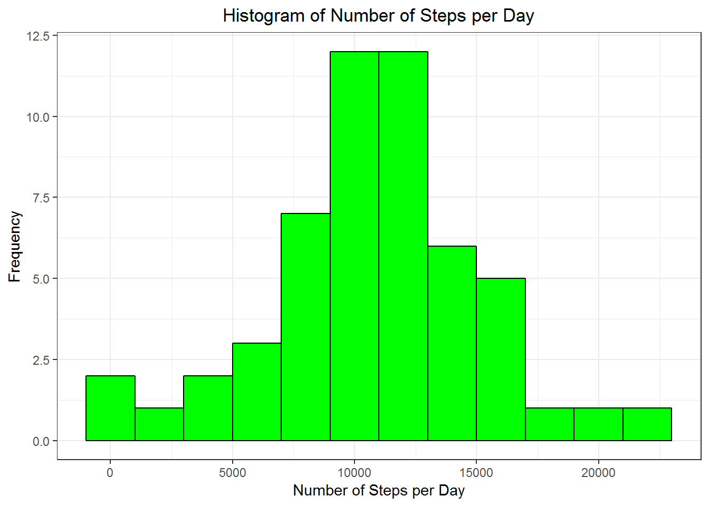
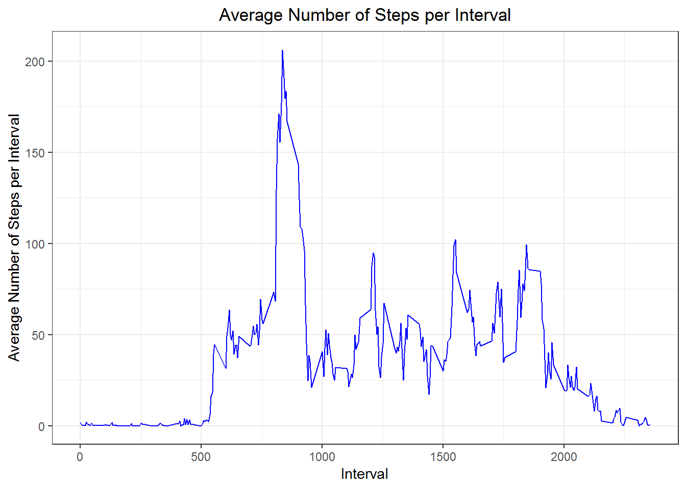
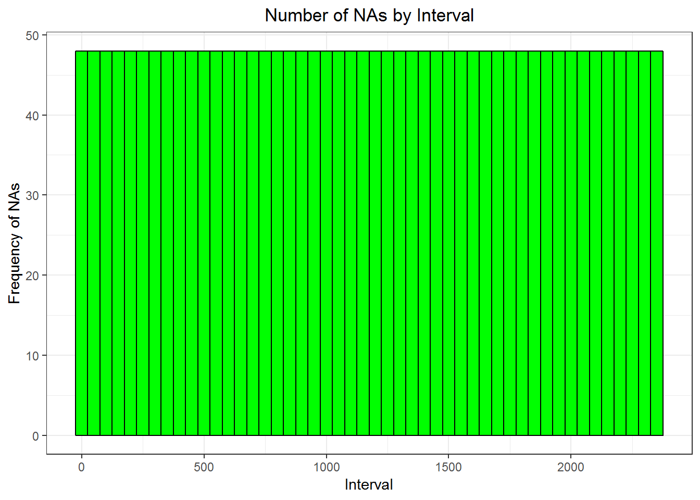
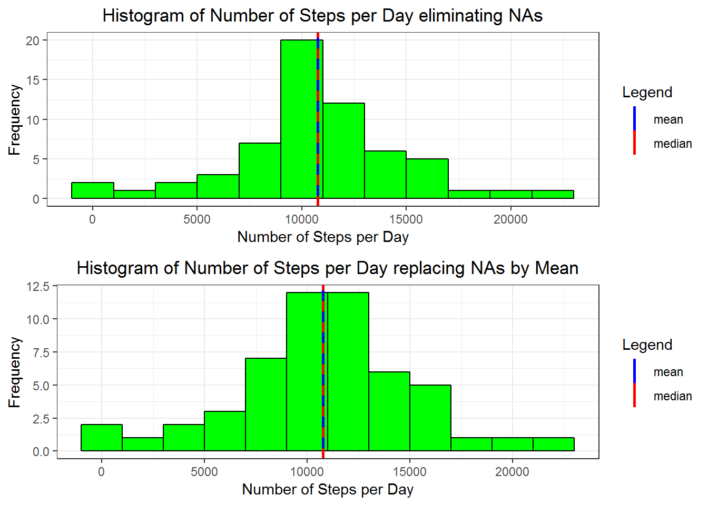
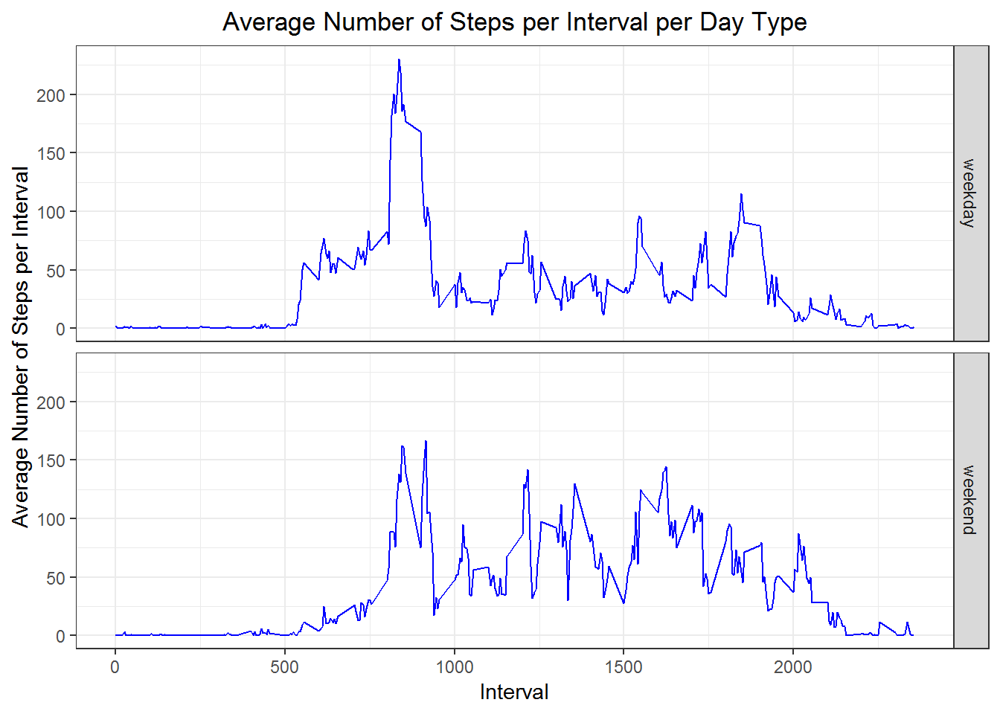

Created by Carlos Hinrichsen

Loading Libraries
-----------------

1.  Loading the required libraries

<!-- -->

    library(ggplot2)

    ## Warning: package 'ggplot2' was built under R version 3.5.1

    library(dplyr)

    ## 
    ## Attaching package: 'dplyr'

    ## The following objects are masked from 'package:stats':
    ## 
    ##     filter, lag

    ## The following objects are masked from 'package:base':
    ## 
    ##     intersect, setdiff, setequal, union

    library(gridExtra)

    ## Warning: package 'gridExtra' was built under R version 3.5.1

    ## 
    ## Attaching package: 'gridExtra'

    ## The following object is masked from 'package:dplyr':
    ## 
    ##     combine

Loading and preprocessing the data
----------------------------------

1.  Loading the data

<!-- -->

    fileUrl <- "https://d396qusza40orc.cloudfront.net/repdata%2Fdata%2Factivity.zip"
    a <- download.file(fileUrl,destfile = "C:/Users/Carlos Hinrichsen/Data/RR/w2c1.zip")
    b <- unzip("C:/Users/Carlos Hinrichsen/Data/RR/w2c1.zip")
    y <- read.csv(b, header = T)

1.  Preprocessing the data

<!-- -->

    y$date <- as.Date(y$date,format = "%Y-%m-%d")

What is mean total number of steps taken per day?
-------------------------------------------------

For this part of the assignment, you can ignore the missing values in
the dataset

1.  Calculate the total number of steps taken per day

<!-- -->

    y2 <- subset(y,!is.na(y$steps))
    sumsteps <- tapply(y2$steps,y2$date,sum)
    sumsteps <- as.data.frame.table(sumsteps)
    colnames(sumsteps) <- c("date","steps")
    head(sumsteps)

    ##         date steps
    ## 1 2012-10-02   126
    ## 2 2012-10-03 11352
    ## 3 2012-10-04 12116
    ## 4 2012-10-05 13294
    ## 5 2012-10-06 15420
    ## 6 2012-10-07 11015

1.  Make a histogram of the total number of steps taken each day

<!-- -->

    g <- ggplot(sumsteps,aes(steps))
    g+geom_histogram(binwidth = 2000,col="black",fill="green")+labs(title="Histogram of Number of Steps per Day")+labs(x="Number of Steps per Day",y="Frequency")+theme_bw()+theme(plot.title = element_text(hjust = 0.5))

1.  Calculate and report the mean and median of the total number of
    steps taken per day

<!-- -->

    meansteps <- mean(sumsteps$steps)
    mediansteps <- median(sumsteps$steps)
    meansteps

    ## [1] 10766.19

    mediansteps

    ## [1] 10765

What is the average daily activity pattern?
-------------------------------------------

1.  Make a time series plot (i.e. type = "l") of the 5-minute interval
    (x-axis) and the average number of steps taken, averaged across all
    days (y-axis)

<!-- -->

    aversteps <- tapply(y2$steps,y2$interval,mean)
    aversteps <- as.data.frame.table(aversteps)
    colnames(aversteps) <- c("interval","steps")
    aversteps$interval <- as.numeric(levels(aversteps$interval))[aversteps$interval]
    g1 <- ggplot(aversteps,aes(interval,steps))
    g1+geom_line(col="blue")+labs(title="Average Number of Steps per Interval")+labs(x="Interval",y="Average Number of Steps per Interval")+theme_bw()+theme(plot.title = element_text(hjust = 0.5))

1.  Which 5-minute interval, on average across all the days in the
    dataset, contains the maximum number of steps?

<!-- -->

    maxsteps <- subset(aversteps, aversteps$steps==max(aversteps$steps))
    maxsteps$interval

    ## [1] 835

Imputing missing values
-----------------------

1.  Calculate and report the total number of missing values in the
    dataset (i.e. the total number of rows with NAs)

<!-- -->

    mval <- sum(is.na(y))
    mval

    ## [1] 2304

1.  Devise a strategy for filling in all of the missing values in the
    dataset. The strategy does not need to be sophisticated. For
    example, you could use the mean/median for that day, or the mean for
    that 5-minute interval, etc.

We will use the strategy of the mean for the 5-minute interval, because
we already measured these values in a previous question. Now we will
understand how many NA value are for each interval

    mvint <- subset(y,is.na(y$steps))
    g2 <- ggplot(mvint,aes(interval))
    g2+geom_histogram(binwidth = 50,col="black",fill="green")+labs(title="Number of NAs by Interval")+labs(x="Interval",y="Frequency of NAs")+theme_bw()+theme(plot.title = element_text(hjust = 0.5))

We can notice that the number of NAs per interval are evenly distributed
(considering a binwidth of 50)

1.  Create a new dataset that is equal to the original dataset but with
    the missing data filled in.

<!-- -->

    merged <- merge(mvint,aversteps,by="interval")
    #Order according to date
    order <- arrange(merged,date)
    #Eliminate extra column because of the merge
    order$steps.x <- NULL
    #Rename the name of the third column because of the merge
    colnames(order)[3] <- "steps"
    #Rearrange order of columns for binding
    order <- order[c(3,2,1)]
    #Bind
    binder <- rbind(order,y2)
    head(binder)

    ##       steps       date interval
    ## 1 1.7169811 2012-10-01        0
    ## 2 0.3396226 2012-10-01        5
    ## 3 0.1320755 2012-10-01       10
    ## 4 0.1509434 2012-10-01       15
    ## 5 0.0754717 2012-10-01       20
    ## 6 2.0943396 2012-10-01       25

1.  Make a histogram of the total number of steps taken each day and
    Calculate and report the mean and median total number of steps taken
    per day. Do these values differ from the estimates from the first
    part of the assignment? What is the impact of imputing missing data
    on the estimates of the total daily number of steps?

<!-- -->

    sumstepsnew <- tapply(binder$steps,binder$date,sum)
    sumstepsnew <- as.data.frame.table(sumstepsnew)
    colnames(sumstepsnew) <- c("date","steps")
    g3 <- ggplot(sumstepsnew,aes(steps))
    a <- g3+geom_histogram(binwidth = 2000,col="black",fill="green")+labs(title="Histogram of Number of Steps per Day eliminating NAs")+labs(x="Number of Steps per Day",y="Frequency")+theme_bw()+theme(plot.title = element_text(hjust = 0.5))+geom_vline(mapping=aes(xintercept=mean(sumstepsnew$steps),color = "mean"),lwd=1,linetype=1,show.legend = T)+geom_vline(mapping=aes(xintercept=median(sumstepsnew$steps),color = "median"),lwd=1,linetype=2,show.legend = T)+scale_color_manual(name="Legend",values = c(mean="blue",median="red"))
    g4 <- ggplot(sumsteps,aes(steps))
    b <- g4+geom_histogram(binwidth = 2000,col="black",fill="green")+labs(title="Histogram of Number of Steps per Day replacing NAs by Mean")+labs(x="Number of Steps per Day",y="Frequency")+theme_bw()+theme(plot.title = element_text(hjust = 0.5))+geom_vline(mapping=aes(xintercept=mean(sumsteps$steps),color = "mean"),lwd=1,linetype=1,show.legend = T)+geom_vline(mapping=aes(xintercept=median(sumsteps$steps),color = "median"),lwd=1,linetype=2,show.legend = T)+scale_color_manual(name="Legend",values = c(mean="blue",median="red"))
    grid.arrange(a,b,nrow=2)

    #Mean of case eliminating NAs
    m1 <- mean(sumsteps$steps)
    m1

    ## [1] 10766.19

    #Median of case eliminating NAs
    md1 <- median(sumsteps$steps)
    md1

    ## [1] 10765

    #Mean of case replacing NAs by Mean
    m2 <- mean(sumstepsnew$steps)
    m2

    ## [1] 10766.19

    #Median of case replacing NAs by Mean
    md2 <- median(sumstepsnew$steps)
    md2

    ## [1] 10766.19

    change <- paste((md2-md1)/md1*100,"%")
    change

    ## [1] "0.0110420738066178 %"

Therefore, even though there is a difference in the median, is very
small. Additionally, we can see that the mean is the same, because we
replaced the NAs values by the mean value by interval.

Are there differences in activity patterns between weekdays and weekends?
-------------------------------------------------------------------------

For this part the weekdays function may be of some help here. Use the
dataset with the filled-in missing values for this part

1.  Create a new factor variable in the dataset with two levels -
    "weekday" and "weekend" indicating whether a given date is a weekday
    or weekend day

<!-- -->

    #Save the local system (in case is not an english environment), for dates in english purposes (if apply)
    old.system <- Sys.getlocale("LC_TIME")
    #Sets the local system into "English", for dates in english purposes
    Sys.setlocale("LC_TIME", "English")

    ## [1] "English_United States.1252"

    binder$days <- as.factor(weekdays(binder$date))
    binder$weekdays <- as.factor(ifelse(binder$days=="Sunday"|binder$days=="Saturday", "weekend", "weekday"))
    binder$days <- NULL
    head(binder)

    ##       steps       date interval weekdays
    ## 1 1.7169811 2012-10-01        0  weekday
    ## 2 0.3396226 2012-10-01        5  weekday
    ## 3 0.1320755 2012-10-01       10  weekday
    ## 4 0.1509434 2012-10-01       15  weekday
    ## 5 0.0754717 2012-10-01       20  weekday
    ## 6 2.0943396 2012-10-01       25  weekday

    #Set the local system into the old
    Sys.setlocale("LC_TIME",old.system)

    ## [1] "Spanish_Chile.1252"

1.  Make a panel plot containing a time series plot (i.e. type = "l") of
    the 5-minute interval (x-axis) and the average number of steps
    taken, averaged across all weekday days or weekend days (y-axis).
    See the README file in the GitHub repository to see an example of
    what this plot should look like using simulated data.

<!-- -->

    aversteps2 <- tapply(binder$steps,list(binder$interval,binder$weekdays),mean)
    aversteps2 <- as.data.frame.table(aversteps2)
    colnames(aversteps2) <- c("interval","weekdays","steps")
    aversteps2$interval <- as.numeric(levels(aversteps2$interval))[aversteps2$interval]
    g5 <- ggplot(aversteps2,aes(interval,steps))
    g5 + facet_grid(weekdays~.)+geom_line(col="blue")+labs(title="Average Number of Steps per Interval per Day Type")+labs(x="Interval",y="Average Number of Steps per Interval")+theme_bw()+theme(plot.title = element_text(hjust = 0.5))

We can see that in weekdays, the average number of steps at the
beginning of the day is greater and start earlier than weekends,
particularly because of the work. In contrast, during the day the
average number of steps is greater in weekend days than weekdays. This,
because we can infer that in the office (or a regular job), people tend
to be seated, but in the weekends people tend to have different kind of
activities
